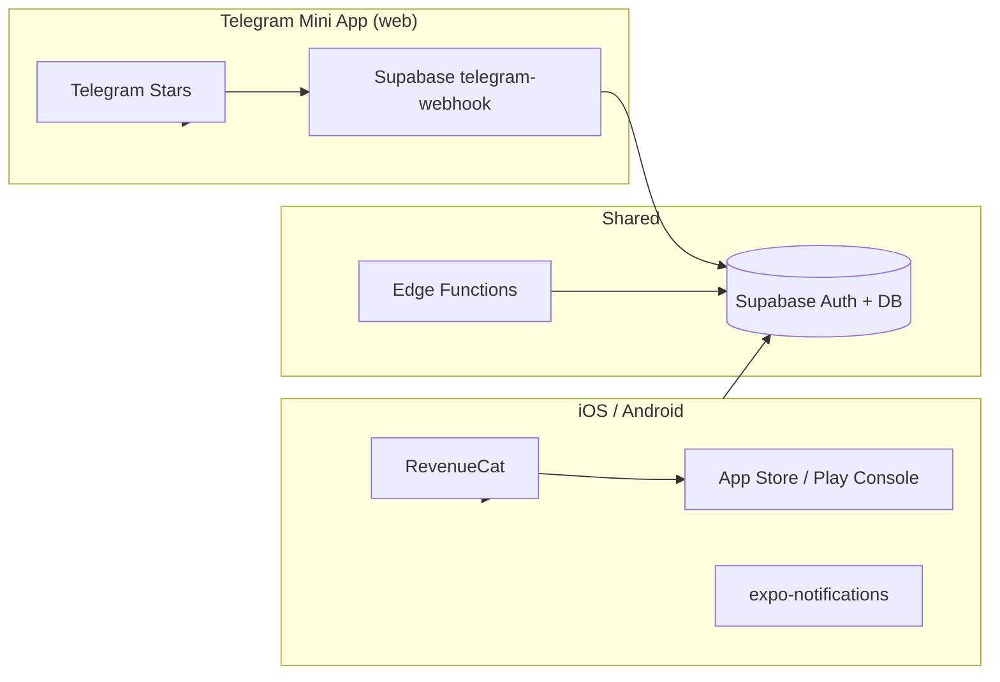

# TrackIt — App Store & Google Play Release Checklist

Step-by-step guide to publish the **native iOS/Android** app. This is separate from the [Telegram Mini App](./TELEGRAM_BOT.md) (web/TMA) deploy on Vercel.

> **Current status:** Phase 1 complete (pushed + `delete-account` deployed). Phase 2 in progress — EAS preview build queued on older commit; rebuild after Phase 2 push.

---

## Execution plan (work in order)

| Phase | Goal | Who | ETA |
|-------|------|-----|-----|
| **0** | Accounts & consoles | You (manual) | 1–2 days |
| **1** | Compliance in code | Agent + you (deploy) | 2–3 days |
| **2** | Release builds (EAS) | Agent + you (secrets) | 2–3 days |
| **3** | Store consoles & billing | You (manual) + agent (docs) | 3–5 days |
| **4** | QA on devices | You + agent (fixes) | 2–3 days |
| **5** | Submit & review | You | 1–7 days review |

**Target:** first submission in ~2–3 weeks if Phases 0–4 run in parallel where possible.

---

### Phase 0 — Prerequisites (you, manual)

No code. Block everything else until these exist.

- [ ] Apple Developer Program active ($99/yr)
- [ ] Google Play Console account ($25 one-time)
- [ ] [RevenueCat](https://www.revenuecat.com/) project created
- [ ] [Expo](https://expo.dev) account + `eas login`
- [ ] Supabase production: all migrations applied
- [ ] Support email decided (currently `support@trackit.app` in legal pages)

---

### Phase 1 — Compliance in code ✅

- [x] Privacy + Terms pages (`public/privacy.html`, `public/terms.html`)
- [x] Links in Settings + Paywall + Auth
- [x] Account deletion + Sign out (`delete-account` edge function)
- [x] Paywall auto-renew disclosure + disable purchase without RevenueCat
- [x] Age gate 13+ on sign-up (Auth)
- [x] Health disclaimer (nutrition settings, workout start)
- [x] AI disclaimer on AI Coach card
- [x] Removed fake Pro claims (export, cloud backups)
- [x] Push + deploy: Vercel; `supabase functions deploy delete-account`
- [ ] Verify `/privacy` and `/terms` live on production URL (after Vercel rebuild)

---

### Phase 2 — Release infrastructure (in progress)

- [x] Add `eas.json` (development / preview / production profiles)
- [x] Add npm scripts: `build:ios`, `build:android`, `submit:*`, `build:preview:*`
- [x] Link Expo project (`extra.eas.projectId` in `app.json`)
- [x] Set EAS env: `EXPO_PUBLIC_SUPABASE_*`, `EXPO_PUBLIC_REVENUECAT_*`
- [x] `app.json`: splash (`expo-splash-screen`), `NSUserNotificationsUsageDescription`, `ITSAppUsesNonExemptEncryption`
- [x] Icon resized to 1024×1024
- [x] `.easignore` to reduce upload size
- [x] Store listing draft (`store/LISTING.md`)
- [ ] First `eas build --platform android --profile preview` on **latest** commit (current queue is stale)
- [ ] `eas build --platform android --profile production` (after Google Play Console)
- [ ] iOS production build (requires Apple Developer Program $99/yr)

---

### Phase 3 — Store consoles & billing (you, manual)

**App Store Connect:**
- [ ] Create app `com.zenith.trackit`
- [ ] Subscriptions: `trackit_pro_monthly`, `trackit_pro_yearly`, 7-day trial
- [ ] Privacy Policy URL, screenshots, description, support URL
- [ ] Privacy Nutrition Labels questionnaire
- [ ] Demo account for App Review

**Google Play Console:**
- [ ] Create app, upload AAB from EAS
- [ ] Same subscription product IDs
- [ ] Data Safety form
- [ ] Feature graphic 1024×500, screenshots
- [ ] Content rating questionnaire

**RevenueCat dashboard:**
- [ ] Link Apple + Google apps
- [ ] Entitlement `pro`, offerings monthly/yearly
- [ ] `REVENUECAT_SECRET_KEY` in Supabase Edge secrets

---

### Phase 4 — QA on real devices (you + agent)

Smoke test on physical iPhone + Android:

- [ ] Sign up / sign in (email, Google, Apple on iOS)
- [ ] Start workout → complete (no crash)
- [ ] Enable notifications → receive reminder
- [ ] Purchase Pro (sandbox) → restore purchases
- [ ] Delete account → confirm data gone, signed out
- [ ] Privacy/Terms links open in browser
- [ ] Paywall shows correct trial/price text

Fix bugs found → rebuild → retest.

---

### Phase 5 — Submit

- [ ] `eas submit` to App Store Connect + Play Console
- [ ] Internal TestFlight / Play internal testing (optional but recommended)
- [ ] Submit for review
- [ ] Respond to reviewer feedback if rejected

---

## Progress tracker

| Area | Before audit | After Phase 1 code | After all phases |
|------|--------------|-------------------|------------------|
| App Store | ~40% | ~55% | 100% submitted |
| Google Play | ~35% | ~50% | 100% submitted |
| TMA (Vercel) | ~75% | ~80% | separate track |

---

## Quick verdict (original audit)

| Channel | Ready? | Notes |
|---------|--------|-------|
| Telegram Mini App (Vercel) | ~75% | Auth, Stars, bot — see `TELEGRAM_BOT.md` |
| App Store (iOS) | ~40% | Missing EAS, legal, account deletion |
| Google Play (Android) | ~35% | Same + `POST_NOTIFICATIONS`, release signing |

**Estimated effort to first store submission:** 3–4 weeks if working through this checklist sequentially.

---

## Architecture (native vs TMA)



**Important:** Native builds must use **RevenueCat / store IAP only**. Telegram Stars billing is gated to `IS_WEB && isTelegramMiniApp()` — do not submit the TMA web bundle as the iOS/Android binary.

---

## Phase 0 — Prerequisites

- [ ] Apple Developer Program ($99/year) — active
- [ ] Google Play Console ($25 one-time) — active
- [ ] [RevenueCat](https://www.revenuecat.com/) project created
- [ ] [Expo EAS](https://expo.dev/eas) account linked to the project
- [ ] Supabase production project with migrations applied
- [ ] Domain for legal pages (can be Vercel: `https://track-it-umber-psi.vercel.app/privacy`, `/terms`)

---

## Phase 1 — Blockers (must fix before submission)

### 1.1 Privacy Policy & Terms of Service

**Why:** Apple Guideline 3.1.2, Google Play subscription policy, GDPR.

| Task | Status | Where |
|------|--------|-------|
| Publish Privacy Policy URL | ✅ | `public/privacy.html` → `/privacy` (Vercel rewrite) |
| Publish Terms of Service URL | ✅ | `public/terms.html` → `/terms` |
| Link from **Settings** | ✅ | `src/screens/SettingsScreen.tsx` (Account section) |
| Link from **Paywall** | ✅ | `src/screens/PremiumScreen.tsx` (legal footer) |
| Link from **Auth** screen (footer) | ☐ | `src/screens/AuthScreen.tsx` |
| Add URLs to App Store Connect listing | ☐ | App Privacy → Privacy Policy URL |
| Add URLs to Play Console listing | ☐ | Store listing → Privacy policy |

**Privacy policy must cover:**
- Supabase (auth, database hosting)
- RevenueCat (subscription status)
- Google Gemini (AI Coach — tasks, workouts, nutrition, finance sent to `generativelanguage.googleapis.com`)
- Health/fitness data (weight, mood, nutrition, workouts — self-reported, not HealthKit)
- Leaderboard (public username, level, XP)
- Data retention and deletion process

**Reference:** Telegram bot already has Stars terms in `supabase/functions/_shared/telegramBot.ts` (`/terms`) — adapt for native store subscriptions.

---

### 1.2 Account deletion (in-app)

**Why:** Apple 5.1.1(v), Google Play account deletion policy, GDPR Art. 17.

| Task | Status | Notes |
|------|--------|-------|
| Add **Delete account** in Settings | ✅ | Confirmation dialog (web `confirm` / native `Alert`) |
| Create Edge Function `delete-account` | ✅ | `supabase/functions/delete-account/index.ts` |
| Cascade user data | ✅ | DB has `on delete cascade` from `auth.users` |
| Sign out after deletion | ✅ | `accountService.ts` signs out after delete |
| **Sign out** button in Settings | ✅ | Account section |
| Document in Privacy Policy | ✅ | `public/privacy.html` — deletion is immediate |

**Deploy note:** run `supabase functions deploy delete-account` (or `npm run deploy:telegram` equivalent) so the function exists in production.

---

### 1.3 Paywall legal compliance (native IAP)

**Why:** Apple 3.1.2(c) — auto-renewing subscriptions require disclosure + legal links.

| Task | Status | File |
|------|--------|------|
| Auto-renewal disclosure text | ✅ | `PremiumScreen.tsx` (native-only footer) |
| Price after trial (from store, not hardcoded) | Partial | Uses live offering price when available, falls back to display pricing |
| Billing period (monthly/yearly) | ✅ | From selected plan |
| How to cancel (Settings → Subscriptions) | ✅ | Platform-specific instructions |
| Privacy Policy link | ✅ | Opens `/privacy` in browser |
| Terms of Service link | ✅ | Opens `/terms` in browser |
| **Restore purchases** button | ✅ | Already present (native) |
| Disable purchase when `!isRevenueCatReady()` | ✅ | Button disabled + config note shown |

**Current constants** (`src/constants/subscriptions.ts`):
- Products: `trackit_pro_monthly`, `trackit_pro_yearly`
- Entitlement: `pro`
- Hardcoded trial: `FREE_TRIAL_DAYS = 7` — **must match** App Store Connect / Play Console trial config
- Fallback prices: `$5.99` / `$59.99` — hide when store offerings unavailable

**Example disclosure (adapt with real prices from store):**
> Payment will be charged to your Apple ID / Google Play account. Subscription automatically renews unless cancelled at least 24 hours before the end of the current period. Manage subscriptions in your device Settings.

---

### 1.4 Pro features — implement or remove from marketing

**Why:** Guideline 2.3.1 — accurate metadata; misleading subscriptions get rejected.

| Advertised feature | Implemented? | Action |
|--------------------|--------------|--------|
| AI Coach | ✅ | Add user-facing AI data disclosure |
| 100+ workout programs | ✅ | — |
| Advanced analytics | ✅ | — |
| Cloud sync | ✅ | Supabase sync |
| **PDF / Excel export** | ❌ | Implement or remove from `PREMIUM_BENEFITS` |
| **Automatic backups** | ❌ | Implement or remove from `PREMIUM_BENEFITS` |
| Premium themes | Partial | Obsidian/Ethereal exist |

**Files:** `src/constants/subscriptions.ts`, `src/lib/subscription/features.ts`

---

### 1.5 Health & AI disclaimers

| Surface | Required copy | File |
|---------|---------------|------|
| Nutrition / BMR / TDEE | "Not medical advice" | `SettingsScreen.tsx` |
| Heart rate zones | Estimated, not from HealthKit | `HeartRateZonesCard.tsx` |
| AI Coach | Data sent to third-party AI; not medical advice | `AiCoachCard.tsx` |
| Workout programs | Consult physician before starting | Optional on workout start |

---

### 1.6 Age gate (COPPA)

| Task | Status | Notes |
|------|--------|-------|
| 13+ attestation at sign-up | ☐ | DB enforces `age >= 13` but UI only checks in nutrition settings |
| Age picker or checkbox on Auth | ☐ | `AuthScreen.tsx` |
| Store age rating | ☐ | Likely 12+ or 17+ depending on health/finance content |

---

## Phase 2 — Release infrastructure

### 2.1 EAS Build & Submit

| Task | Status | Command / file |
|------|--------|----------------|
| Create `eas.json` | ☐ | `production`, `preview`, `development` profiles |
| Add `eas-cli` scripts to `package.json` | ☐ | `build:ios`, `build:android`, `submit:*` |
| Link Expo project | ☐ | `eas init` |
| iOS distribution cert + provisioning | ☐ | EAS managed credentials |
| Android upload keystore | ☐ | EAS managed credentials (not debug keystore) |
| Set `EXPO_PUBLIC_*` in EAS secrets | ☐ | Supabase, RevenueCat keys at **build time** |

**Suggested `eas.json` skeleton:**
```json
{
  "cli": { "version": ">= 16.0.0", "appVersionSource": "remote" },
  "build": {
    "development": { "developmentClient": true, "distribution": "internal" },
    "preview": { "distribution": "internal" },
    "production": { "autoIncrement": true }
  },
  "submit": {
    "production": {}
  }
}
```

---

### 2.2 App config (`app.json`)

| Item | Current | Action |
|------|---------|--------|
| `version` | `1.0.0` | Bump per release |
| `ios.buildNumber` | Not in app.json | Add or use EAS `autoIncrement` |
| `android.versionCode` | Not in app.json | Add or use EAS `autoIncrement` |
| Bundle ID | `com.zenith.trackit` | ✅ Consistent |
| Splash screen | Missing from config | Add `expo-splash-screen` plugin |
| Notification permission string | Missing | Add `NSUserNotificationsUsageDescription` via plugin |
| `ITSAppUsesNonExemptEncryption` | Missing | Set `false` if only HTTPS (standard) |
| Icon size | 1040×1040 | Resize to **1024×1024** for App Store |

---

### 2.3 Environment variables (production build)

Set in **EAS Secrets** (not committed):

| Variable | Required for | Reference |
|----------|--------------|-----------|
| `EXPO_PUBLIC_SUPABASE_URL` | Auth, data | `.env.example` |
| `EXPO_PUBLIC_SUPABASE_ANON_KEY` | Auth, data | `.env.example` |
| `EXPO_PUBLIC_REVENUECAT_APPLE_KEY` | iOS IAP | `.env.example` |
| `EXPO_PUBLIC_REVENUECAT_GOOGLE_KEY` | Android IAP | `.env.example` |

Set in **Supabase Edge Function secrets**:

| Variable | Purpose |
|----------|---------|
| `REVENUECAT_SECRET_KEY` | `sync-subscription-status`, AI Pro checks |
| `GEMINI_API_KEY` | AI Coach |
| `SUPABASE_SERVICE_ROLE_KEY` | Admin operations (account deletion) |

---

### 2.4 RevenueCat & store products

| Step | iOS (App Store Connect) | Android (Play Console) |
|------|-------------------------|------------------------|
| Create subscription group | TrackIt Pro | TrackIt Pro |
| Monthly product ID | `trackit_pro_monthly` | `trackit_pro_monthly` |
| Yearly product ID | `trackit_pro_yearly` | `trackit_pro_yearly` |
| Free trial | 7 days (match `FREE_TRIAL_DAYS`) | 7 days |
| Prices | $5.99/mo, $59.99/yr | Match or localize |
| RevenueCat entitlement | `pro` | `pro` |
| Link products in RevenueCat dashboard | Apple + Google | Same project |

**Code paths:**
- Client: `src/lib/subscription/subscriptionService.ts`
- Bootstrap: `src/components/subscription/SubscriptionBootstrap.tsx`
- Server sync: `supabase/functions/sync-subscription-status/index.ts`

---

### 2.5 Android-specific

| Task | Status | Notes |
|------|--------|-------|
| `POST_NOTIFICATIONS` permission (API 33+) | ☐ | Required for push on Android 13+ |
| Release signing (not debug keystore) | ☐ | Use EAS credentials |
| `google-services.json` (FCM) | ☐ | If using push on Android |
| Data Safety form in Play Console | ☐ | Health, finance, account data |
| Target API level | ✅ | compileSdk 36 via Expo 56 |

---

### 2.6 iOS-specific

| Task | Status | Notes |
|------|--------|-------|
| `aps-environment: production` | ☐ | Currently `development` in entitlements |
| Push notification capability | ☐ | If using remote push |
| Sign in with Apple | ✅ | `usesAppleSignIn: true`, `apple.native.ts` |
| Privacy Nutrition Labels | ☐ | Match actual data collection |
| `PrivacyInfo.xcprivacy` | Partial | Update `NSPrivacyCollectedDataTypes` |
| App Review notes | ☐ | Demo account credentials for reviewer |

---

## Phase 3 — Store listing assets

### 3.1 Required assets

| Asset | App Store | Google Play |
|-------|-----------|-------------|
| App icon 1024×1024 | ✅ (resize from 1040) | ✅ |
| Screenshots (phone) | 6.7", 6.5" required | Phone required |
| Screenshots (tablet) | If `supportsTablet: true` | Optional |
| Short description | Subtitle (30 chars) | 80 chars |
| Full description | Up to 4000 chars | Up to 4000 chars |
| Keywords | 100 chars | — |
| Feature graphic | — | 1024×500 |
| Promo video | Optional | Optional |
| Privacy policy URL | Required | Required |
| Support URL / email | Required | Required |

**Repo gap:** No `screenshots/` or `store/` folder yet — create and version control listing copy (not necessarily image binaries).

---

### 3.2 Suggested listing copy (draft)

**Subtitle / short:** Intelligent life OS — tasks, workouts, nutrition

**Categories:**
- App Store: Health & Fitness (primary), Productivity (secondary)
- Play: Health & Fitness

**Highlight features:** AI Coach, workout programs, nutrition tracking, finance, habits, gamification (XP/levels).

---

## Phase 4 — QA before submit

### 4.1 Device smoke tests

Test on **physical** iOS and Android devices (not simulator-only):

| Flow | iOS | Android |
|------|-----|---------|
| Email sign-up / sign-in | ☐ | ☐ |
| Google OAuth | ☐ | ☐ |
| Apple Sign In | ☐ | N/A |
| Onboarding (welcome gate) | ☐ | ☐ |
| Start workout → complete session | ☐ | ☐ |
| Nutrition log | ☐ | ☐ |
| Enable push reminders | ☐ | ☐ |
| Open paywall → purchase (sandbox) | ☐ | ☐ |
| Restore purchases | ☐ | ☐ |
| Sign out | ☐ | ☐ |
| Delete account | ☐ | ☐ |
| Deep link from notification | ☐ | ☐ |
| Offline → sync error toast | ☐ | ☐ |

---

### 4.2 Automated checks

| Task | Status | Command |
|------|--------|---------|
| TypeScript strict | ✅ | `npx tsc --noEmit` |
| Unit tests pass | ☐ | `npm test` (fix jest preset if needed) |
| CI on PR | ☐ | GitHub Actions: `tsc` + `test` |
| Production EAS build succeeds | ☐ | `eas build --platform all --profile production` |

---

### 4.3 Crash & error monitoring

| Task | Status | Recommendation |
|------|--------|----------------|
| Native Error Boundary | ☐ | Wrap `App.tsx` root (web has `WebBootErrorBoundary`) |
| Crash reporting SDK | ☐ | Sentry or Expo crash reporting |
| RevenueCat webhook / listener | ☐ | Optional but recommended for entitlement sync |

---

## Phase 5 — Store console questionnaires

### 5.1 Apple App Privacy

Declare collection for:
- Contact info (email)
- Health & fitness (weight, nutrition, workouts, mood)
- Financial info (transactions, budgets)
- User content (journal, tasks)
- Identifiers (user ID)
- Usage data (if added later)

Third-party sharing:
- **Google Gemini** (AI Coach processing)
- **Supabase** (hosting)
- **RevenueCat** (subscription status)

---

### 5.2 Google Play Data Safety

Same categories as Apple. Mark:
- Data encrypted in transit (HTTPS) ✅
- Users can request deletion ☐ (after implementing account deletion)
- Data is optional vs required per feature

---

## Phase 6 — Submission

### 6.1 App Store Connect

1. Create app record → bundle ID `com.zenith.trackit`
2. Upload build via EAS Submit or Transporter
3. Fill metadata, screenshots, privacy URL
4. Configure subscriptions (match product IDs)
5. App Review Information: demo account + notes
6. Submit for review

**Common rejection reasons to avoid:**
- Missing account deletion
- Paywall without legal links / auto-renew text
- Trial length mismatch between UI and ASC
- Advertised features not in app

---

### 6.2 Google Play Console

1. Create app → package `com.zenith.trackit`
2. Upload AAB via EAS Submit
3. Store listing + Data Safety + content rating questionnaire
4. Configure subscriptions (match product IDs)
5. Internal testing → closed testing → production rollout

---

## File reference map

| Area | Key files |
|------|-----------|
| App config | `app.json` |
| Subscriptions | `src/constants/subscriptions.ts`, `src/lib/subscription/subscriptionService.ts` |
| Paywall | `src/screens/PremiumScreen.tsx`, `src/components/paywall/PaywallHost.tsx` |
| Auth | `src/screens/AuthScreen.tsx`, `src/hooks/useAuth.tsx` |
| Settings | `src/screens/SettingsScreen.tsx` |
| Notifications | `src/lib/notifications/reminderService.ts` |
| AI Coach | `src/lib/ai/coachService.ts`, `supabase/functions/ai-coach-analyze/` |
| Pro features metadata | `src/lib/subscription/features.ts` |
| TMA billing (separate) | `docs/TELEGRAM_BOT.md`, `src/lib/subscription/tmaAccessService.ts` |
| Env template | `.env.example` |

---

## Priority order (recommended)

```text
Week 1 — Compliance blockers
  ├── Privacy Policy + Terms (hosted + linked in app)
  ├── Account deletion + Sign out in Settings
  ├── Paywall legal footer (native)
  └── Remove or implement export/backup claims

Week 2 — Infrastructure
  ├── eas.json + production builds
  ├── RevenueCat + ASC/Play products
  ├── Health/AI disclaimers + age gate
  └── Fix Android POST_NOTIFICATIONS, iOS push entitlements

Week 3 — Polish & QA
  ├── Store screenshots + descriptions
  ├── Device smoke tests (purchase, restore, delete account)
  ├── CI + crash reporting
  └── Privacy questionnaires (Apple + Google)

Week 4 — Submit
  ├── Internal/TestFlight + Play internal track
  ├── Fix review feedback
  └── Production release
```

---

## What's already in good shape

- Consistent bundle ID and app identity
- RevenueCat integration with restore purchases
- Apple Sign In + Google OAuth
- Platform splits (native/web/TMA isolated)
- Supabase RLS and auth
- Push notifications with user opt-in
- Deep linking for in-app navigation
- No secrets committed to git
- Telegram Stars billing correctly separated from native IAP

---

## Related docs

- [TELEGRAM_BOT.md](./TELEGRAM_BOT.md) — Mini App, Stars, bot webhook (separate from store release)
- [AGENTS.md](../AGENTS.md) — Expo 56, web/TMA deploy (`npm run export:web`)
- [.env.example](../.env.example) — all environment variables

---

*Last updated: audit-based checklist. Re-run audit after major feature changes before each store submission.*
