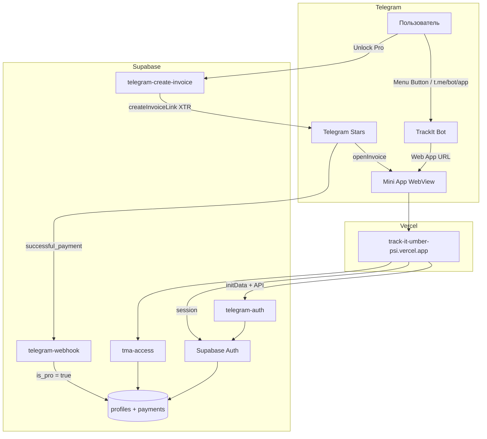

# TrackIt — Telegram Bot & Mini App

Полная схема: как пользователь открывает приложение, входит через Telegram и платит Stars.

## Архитектура



## Компоненты

| Часть | Где | Задача |
|-------|-----|--------|
| **Mini App (клиент)** | Vercel / `dist/` | UI, `WebApp.openInvoice`, localStorage сессии |
| **Bot** | @BotFather | Кнопка меню → URL приложения |
| **telegram-auth** | Supabase Edge | Автовход по `initData`, создание аккаунта |
| **tma-access** | Supabase Edge | 3-дневный триал, привязка `telegram_user_id` |
| **telegram-create-invoice** | Supabase Edge | Создание счёта Stars (подписка / месяц) |
| **telegram-webhook** | Supabase Edge | Подтверждение оплаты → `profiles.is_pro` |
| **Supabase DB** | Postgres | `profiles`, `telegram_stars_payments` |

---

## Путь пользователя

### 1. Открыть приложение

1. Пользователь открывает бота в Telegram
2. Нажимает **Menu** (кнопка слева от поля ввода) или ссылку `t.me/YourBot/app`
3. Telegram загружает Mini App: `https://track-it-umber-psi.vercel.app`
4. `TelegramBootstrap` → `initTelegramWebApp()`
5. `App.tsx` → `tryTelegramAutoSignIn()` если нет сессии
6. Пользователь попадает в приложение **без ввода email/пароля**

### 2. Триал (3 дня)

- При первом входе `tma-access` ставит `tma_trial_started_at`
- 3 дня: Pro + Telegram-напоминания
- После триала — paywall, нужны Stars

### 3. Оплата Stars

1. Profile → **TrackIt Pro** → «Unlock Pro — N Stars / month»
2. Клиент: `telegram-create-invoice` + `initData`
3. Сервер: `createInvoiceLink` (currency `XTR`, `subscription_period: 2592000`)
4. Клиент: `WebApp.openInvoice(invoiceUrl)` — окно оплаты Telegram
5. Telegram → `telegram-webhook` → `grantStarsPro()` → `is_pro = true`
6. Клиент: `syncTmaAccess()` → Pro активен

---

## Настройка с нуля

### Шаг 1 — BotFather

```
/mybots → выбрать бота
Bot Settings → Menu Button → Web App
URL: https://track-it-umber-psi.vercel.app
```

Сохрани **API Token** бота.

### Шаг 2 — Vercel (клиент)

Environment Variables (**Production**):

```
EXPO_PUBLIC_SUPABASE_URL=https://vvdakzkcfnmczddukgtg.supabase.co
EXPO_PUBLIC_SUPABASE_ANON_KEY=<anon key>
EXPO_PUBLIC_WEB_APP_URL=https://track-it-umber-psi.vercel.app
EXPO_PUBLIC_TMA_STARS_PRICE=250
```

После изменений → **Redeploy** (без build cache).

### Шаг 3 — Supabase Auth

**Authentication → URL Configuration → Redirect URLs:**

```
https://track-it-umber-psi.vercel.app/auth/callback
```

### Шаг 4 — Supabase Secrets

**Project Settings → Edge Functions → Secrets:**

| Secret | Описание |
|--------|----------|
| `TELEGRAM_BOT_TOKEN` | Токен от BotFather |
| `TMA_STARS_PRICE` | Цена в Stars (напр. `250`) |
| `SUPABASE_SERVICE_ROLE_KEY` | Service role |
| `SUPABASE_URL` | URL проекта |
| `SUPABASE_ANON_KEY` | Anon key |
| `TMA_AUTH_SECRET` | (опционально) секрет для паролей TMA-auth |

### Шаг 5 — Deploy Edge Functions

```bash
supabase functions deploy telegram-auth
supabase functions deploy telegram-create-invoice
supabase functions deploy telegram-webhook
supabase functions deploy tma-access
supabase db push   # если миграции ещё не применены
```

### Шаг 6 — Webhook (не через BotFather)

Webhook ставится **через API**, не командой BotFather:

```bash
curl -X POST "https://api.telegram.org/bot<ТВОЙ_ТОКЕН>/setWebhook" \
  -H "Content-Type: application/json" \
  -d '{
    "url": "https://vvdakzkcfnmczddukgtg.supabase.co/functions/v1/telegram-webhook",
    "allowed_updates": ["pre_checkout_query", "message"]
  }'
```

Проверка:

```bash
curl "https://api.telegram.org/bot<ТВОЙ_ТОКЕН>/getWebhookInfo"
```

---

## Проверка работы

| Что проверить | Ожидание |
|---------------|----------|
| Открыть из бота | TrackIt загружается, автовход |
| Закрыть / открыть снова | Без повторного логина |
| Premium → Stars | Окно оплаты Telegram |
| После оплаты | Pro активен, триал не нужен |
| Supabase Logs → `telegram-webhook` | `successful_payment` обработан |

---

## Частые проблемы

| Проблема | Решение |
|----------|---------|
| Пустой экран на Vercel | Promote to Production рабочего деплоя |
| «Supabase is not configured» | Env на Vercel + Redeploy |
| Кнопка Stars не открывает оплату | Открывать только из Telegram, не из Safari |
| Оплата прошла, Pro нет | Webhook не настроен → curl setWebhook |
| Webhook 401 | `verify_jwt = false` для `telegram-webhook` в `supabase/config.toml`, redeploy |
| Каждый раз логин | Задеплоить `telegram-auth`, проверить `TELEGRAM_BOT_TOKEN` |

---

## Ключевые файлы в репозитории

| Файл | Назначение |
|------|------------|
| `src/lib/auth/telegramAuthService.ts` | Автовход клиента |
| `src/lib/subscription/tmaAccessService.ts` | Триал + invoice |
| `src/lib/telegram/starsPayment.web.ts` | `WebApp.openInvoice` |
| `supabase/functions/telegram-auth/` | Создание/вход аккаунта |
| `supabase/functions/telegram-create-invoice/` | Счёт Stars |
| `supabase/functions/telegram-webhook/` | Подтверждение оплаты |
| `supabase/functions/tma-access/` | Триал и доступ |
| `supabase/migrations/20260712180000_tma_stars_access.sql` | Схема БД |

---

## Безопасность

- **Никогда** не клади `TELEGRAM_BOT_TOKEN` и `SERVICE_ROLE_KEY` в Vercel / клиент
- `initData` валидируется на сервере (HMAC + bot token)
- `is_pro` меняется только через service role (webhook)
- Anon key в Vercel — нормально (публичный клиентский ключ)
