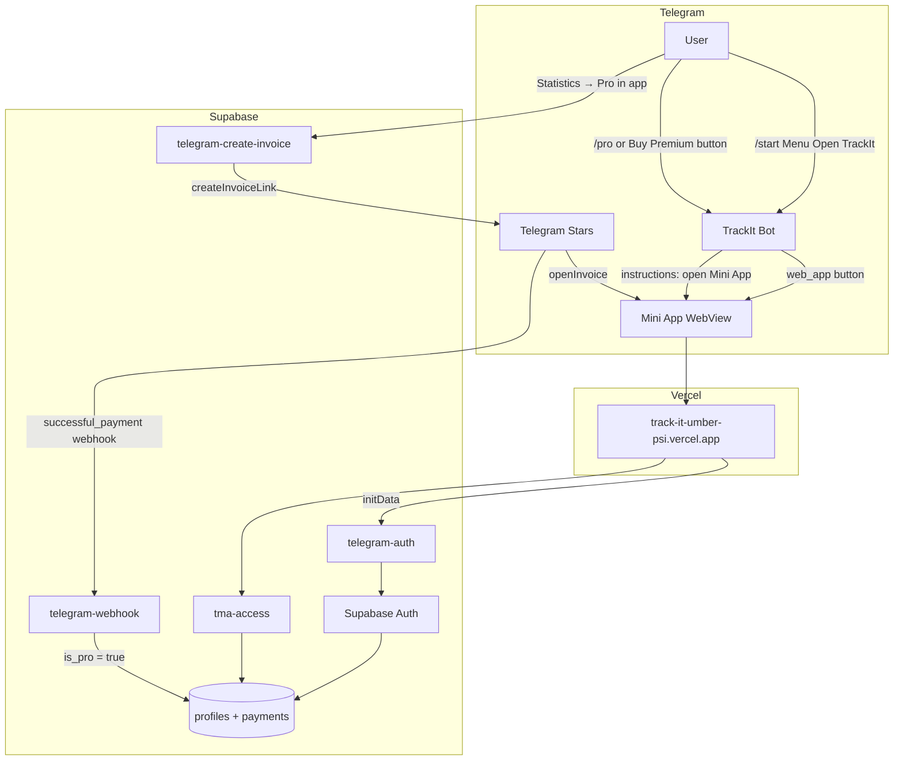

# TrackIt — Telegram Bot & Mini App

Full guide: how users open the app, sign in via Telegram, and pay with Stars.

> **No separate Node.js / Telegraf server needed.** TrackIt uses **Supabase Edge Functions** as the bot backend (`/start`, WebApp button, `pre_checkout_query`, `successful_payment`). You do not run a second server alongside Vercel.

## Telegraf tutorial → TrackIt equivalent

| Tutorial (Telegraf) | TrackIt implementation |
|----------------------|-------------------------|
| `bot.start()` welcome + WebApp button | `telegram-webhook` → `handleStartCommand()` |
| `ctx.sendInvoice` (XTR, ~300 Stars) | **Not used in chat** — `/pro` and **Buy Premium** send instructions instead |
| `createInvoiceLink` + `openInvoice` | Mini App `telegram-create-invoice` → `starsPayment.web.ts` |
| `answerPreCheckoutQuery(true)` | `telegram-webhook` pre_checkout handler |
| `successful_payment` → thank you | `grantStarsPro()` + `sendPaymentSuccessMessage()` |
| `PremiumScreen` → `purchaseWithStars()` | Already wired in `useSubscriptionStore` |

## Telegram Stars payment flow (official)

Per [Bot Payments API for Digital Goods](https://core.telegram.org/bots/payments-stars):

| Step | Telegram API | TrackIt |
|------|--------------|---------|
| 1. Create invoice | `createInvoiceLink`, `currency: "XTR"`, no `provider_token` | Mini App only: `telegram-create-invoice` |
| 2. Pre-checkout | `pre_checkout_query` → `answerPreCheckoutQuery` within **10 s** | `starsPayment.ts` (sync in webhook) |
| 3. Checkout | `successful_payment` update | `handleSuccessfulPayment()` → `grantStarsPro()` |
| 4. Store charge ID | `telegram_payment_charge_id` | `telegram_stars_payments` table |
| 5. Support | `/paysupport` command | `handlePaySupportCommand()` |

**Mini App:** `createInvoiceLink` → `WebApp.openInvoice(url)` → same webhook handles payment.

**No BotFather Payments setup** for digital goods — only `XTR`, no provider token.

## BotFather checklist

1. `@BotFather` → `/mybots` → your bot → **Bot Settings** → **Menu Button** → Web App → `https://track-it-umber-psi.vercel.app` (or run `npm run setup:telegram-bot`)
2. Set webhook via `npm run setup:telegram-bot` — **not** a local Node server

**Telegram Stars (`XTR`) — no Payments setup in BotFather.** For digital goods and Mini Apps you do not connect Stripe/YooKassa and you do not pass `provider_token`. Just `currency: "XTR"` and `prices` in `createInvoiceLink` (Mini App checkout).

**Balance & withdrawals:** Telegram → your bot profile → **Manage Bot** → **Balance** (Stars history, TON withdrawal via Fragment).

## Architecture



## Components

| Part | Location | Role |
|------|----------|------|
| **Mini App (client)** | Vercel / `dist/` | UI, `WebApp.openInvoice`, session in localStorage |
| **Telegram bot** | BotFather + `telegram-webhook` | `/start`, menu, payment instructions (no in-chat invoice) |
| **telegram-auth** | Supabase Edge | Auto sign-in from `initData` |
| **tma-access** | Supabase Edge | 3-day trial, `telegram_user_id` sync |
| **telegram-create-invoice** | Supabase Edge | Stars invoice link for in-app checkout |
| **telegram-webhook** | Supabase Edge | Bot commands, payment confirmation, `is_pro` |
| **Supabase DB** | Postgres | `profiles`, `telegram_stars_payments` |

---

## User journey

### 1. Open the app

1. User opens **@YourTrackItBot** in Telegram
2. Sends `/start` or taps **Menu → Open TrackIt**
3. Telegram loads the Mini App: `https://track-it-umber-psi.vercel.app`
4. `TelegramBootstrap` initializes the WebApp SDK
5. `App.tsx` runs `tryTelegramAutoSignIn()` when there is no session
6. User lands in TrackIt **without email/password**

### 2. Free trial (3 days)

- On first access, `tma-access` sets `tma_trial_started_at`
- For 3 days: full Pro + Telegram reminders
- After the trial: paywall — Stars subscription required

### 3. Pay with Stars

**In-chat payment is not supported.** Stars checkout works only inside the Mini App.

**From the bot (instructions only):**

1. `/pro` or tap **Buy Premium — N Stars**
2. Bot replies with steps: **Open TrackIt** → **Statistics** tab → tap **Pro** on the upgrade banner → pay with Stars

**From the Mini App (actual checkout):**

1. Open **Statistics** tab → tap **Pro** on the upgrade banner (or Profile → **TrackIt Pro**)
2. Client calls `telegram-create-invoice` with `initData`
3. Server returns `createInvoiceLink` (`XTR`, `subscription_period: 2592000`)
4. Client opens `WebApp.openInvoice(invoiceUrl)`
5. Telegram sends `successful_payment` to `telegram-webhook`
6. Client calls `syncTmaAccess()` → Pro is active

---

## Bot commands (English)

| Command | Description |
|---------|-------------|
| `/start` | Welcome message + **Open TrackIt** / **Buy Premium** buttons |
| `/app` | Open the Mini App |
| `/pro` | How to buy Pro in the Mini App (Statistics → Pro) |
| `/status` | Trial days left or Pro expiry |
| `/help` | Full guide |

---

## Setup from scratch

### Step 1 — Create the bot in BotFather

1. Open [@BotFather](https://t.me/BotFather)
2. `/newbot` → name: **TrackIt**, username: e.g. `TrackItAppBot`
3. Save the **API token**

Optional in BotFather (or use the setup script below):

- `/setdescription` — bot profile text
- `/setcommands` — command list

### Step 2 — Vercel (Mini App client)

**Environment Variables** (Production scope):

```
EXPO_PUBLIC_SUPABASE_URL=https://vvdakzkcfnmczddukgtg.supabase.co
EXPO_PUBLIC_SUPABASE_ANON_KEY=<anon key>
EXPO_PUBLIC_WEB_APP_URL=https://track-it-umber-psi.vercel.app
EXPO_PUBLIC_TMA_STARS_PRICE=300
```

Redeploy after changes (disable build cache).

### Step 3 — Supabase Auth

**Authentication → URL Configuration → Redirect URLs:**

```
https://track-it-umber-psi.vercel.app/auth/callback
```

### Step 4 — Supabase Edge Function secrets

**Project Settings → Edge Functions → Secrets:**

| Secret | Description |
|--------|-------------|
| `TELEGRAM_BOT_TOKEN` | Bot token from BotFather |
| `TMA_STARS_PRICE` | Stars charged at checkout (~300 ≈ $5.99/month) |
| `TMA_MONTHLY_PRICE_LABEL` | Display price in bot messages (default `$5.99/month`) |
| `TMA_WEB_APP_URL` | Mini App URL (same as Vercel production URL) |
| `TMA_AUTH_SECRET` | Random secret for TMA auth passwords |
| `ALLOWED_ORIGIN` | `https://track-it-umber-psi.vercel.app` |
| `SUPABASE_SERVICE_ROLE_KEY` | Service role key |
| `SUPABASE_URL` | Project URL |
| `SUPABASE_ANON_KEY` | Anon key |
| `CRON_SECRET` | Random secret for scheduled reminder job |

### Step 5 — Deploy Edge Functions

```bash
npx supabase login
npx supabase link --project-ref vvdakzkcfnmczddukgtg
npx supabase db push
npx supabase functions deploy telegram-auth
npx supabase functions deploy telegram-webhook
npx supabase functions deploy tma-access
npx supabase functions deploy telegram-create-invoice
npx supabase functions deploy telegram-send-reminders
npx supabase functions deploy telegram-reminder-welcome
npx supabase secrets set CRON_SECRET="$(openssl rand -hex 32)"
```

### Step 5b — Schedule chat reminders (pg_cron)

1. Supabase Dashboard → **Database → Extensions** → enable `pg_cron` and `pg_net`
2. Edit `scripts/setup-telegram-cron.sql` — replace `YOUR_PROJECT_REF` and `YOUR_CRON_SECRET`
3. Run the SQL in **SQL Editor**

Reminders run every 15 minutes and send the same schedule as the native app (08:00–22:00) to users with **Settings → Telegram Reminders** enabled and active trial/Pro.

### Step 6 — Configure bot + webhook (one command)

```bash
TELEGRAM_BOT_TOKEN="YOUR_BOT_TOKEN" \
TMA_WEB_APP_URL="https://track-it-umber-psi.vercel.app" \
TMA_STARS_PRICE=300 \
SUPABASE_PROJECT_REF=vvdakzkcfnmczddukgtg \
node scripts/setup-telegram-bot.mjs
```

This script:

- Sets English bot commands (`/start`, `/app`, `/pro`, `/status`, `/help`)
- Sets bot description and short description
- Sets **Menu button → Open TrackIt** (Web App)
- Registers webhook with `message`, `callback_query`, `pre_checkout_query`

Manual webhook (alternative):

```bash
curl -X POST "https://api.telegram.org/bot<TOKEN>/setWebhook" \
  -H "Content-Type: application/json" \
  -d '{
    "url": "https://vvdakzkcfnmczddukgtg.supabase.co/functions/v1/telegram-webhook",
    "allowed_updates": ["message", "callback_query", "pre_checkout_query"]
  }'
```

Verify:

```bash
curl "https://api.telegram.org/bot<TOKEN>/getWebhookInfo"
```

---

## Testing checklist

| Test | Expected |
|------|----------|
| `/start` in bot | English welcome + Open TrackIt button |
| Menu → Open TrackIt | Mini App loads, auto sign-in |
| Close / reopen app | No repeated login |
| `/status` during trial | Shows days remaining |
| `/pro` in bot | Instructions to pay in Mini App (Statistics → Pro) |
| Premium → Stars in app | Telegram payment sheet |
| After payment | Pro active, bot sends confirmation |
| Enable Telegram Reminders in app | Welcome message in bot chat |
| At scheduled times | Reminder messages in bot chat with Open TrackIt button |
| Supabase Logs → `telegram-webhook` | `successful_payment` handled |

---

## Troubleshooting

| Issue | Fix |
|-------|-----|
| Blank Vercel page | Promote working deployment to Production |
| "Supabase is not configured" | Set Vercel env vars + redeploy |
| Stars button does nothing | Open only inside Telegram, not Safari |
| Payment succeeded, no Pro | Run `setup-telegram-bot.mjs` or set webhook manually |
| Webhook 401 | `verify_jwt = false` for `telegram-webhook` in `supabase/config.toml`, redeploy |
| Login every time | Deploy `telegram-auth`, check `TELEGRAM_BOT_TOKEN` |
| Bot does not reply to `/start` | Redeploy `telegram-webhook`, check webhook `allowed_updates` includes `message` and `callback_query` |

---

## Key files

| File | Purpose |
|------|---------|
| `supabase/functions/_shared/telegramBot.ts` | Bot messages, keyboards, Stars invoice in chat |
| `supabase/functions/telegram-webhook/` | Webhook router (commands + payments) |
| `scripts/setup-telegram-bot.mjs` | One-shot bot + webhook setup |
| `src/lib/auth/telegramAuthService.ts` | Client auto sign-in |
| `src/lib/subscription/tmaAccessService.ts` | Trial + in-app invoice |
| `src/lib/telegram/starsPayment.web.ts` | `WebApp.openInvoice` |
| `supabase/functions/telegram-auth/` | Account creation / sign-in |
| `supabase/functions/telegram-create-invoice/` | In-app Stars invoice link |
| `supabase/functions/tma-access/` | Trial and access status |
| `supabase/migrations/20260712180000_tma_stars_access.sql` | DB schema |

---

## Security

- Never put `TELEGRAM_BOT_TOKEN` or `SERVICE_ROLE_KEY` in Vercel or the client
- `initData` is validated server-side (HMAC + bot token)
- `is_pro` is updated only via service role (webhook)
- Anon key in Vercel is fine (public client key)
